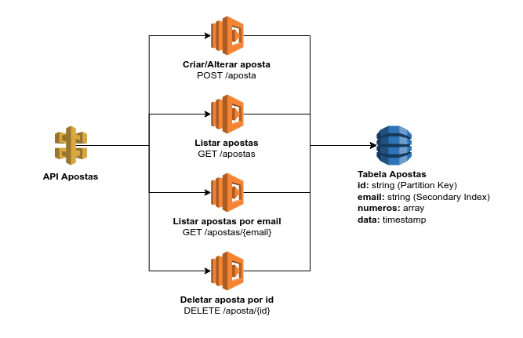

# Loteria Online - Tarefa 1

Essa tarefa tem o propósito de ensinar como criar uma API na AWS utilizando o SAM.

Os principais recursos que( deverão ser utilizados:

* API Gateway
* Lambda
* DynamoDB

Aqui está uma representação visual de como a API final irá ficar:


## Requisitos
* Antes de começar, altere o valor `MENTORSHIP_STACK_NAME` no arquivo `.env`. Esse valor será usado como o nome da stack no CloudFormation.
* Rode o comando `npm i` para instalar as dependências do projeto, neste caso o `loteria-online`.
* Para fazer o deploy da sua stack, você poderá executar `npm run deploy`.
* Você deverá criar testes unitários para suas funções utilizando o framework [Jest](https://jestjs.io/). O ideal é que todas elas tenham 100% de cobertura. Há um exemplo da estrutura padrão do Jest no diretório `src/example/`. (Caso se sentir confortável, configure o Jest para estrutura que você preferir.)
* Utilize a versão do **NodeJs 14x** para todas as Lambdas. Também utilize a arquitetura **arm64**.

## Descrição da Tarefa

1. Criar uma tabela do DynamoDB com as seguintes características:
    * O nome da tabela deverá ser no seguinte formato: <nome_da_stack>_apostas.
    * A tabela deverá ter um campo "id" como partition key, e esse campo será do tipo string.
    * O tipo de cobrança da tabela deverá ser por demanda (PAY_PER_REQUEST).
    * Os registros dessa tabela deverão obedecer o seguinte formato:
    ```
        {
            "id": string,
            "email": string,
            "numeros": array,
            "data": timestamp
        }
    ```
    * A tabela deverá ter um index secundário para o campo "email".

2. Criar uma API utilizando API Gateway + Lambda para registrar apostas. Ela deverá aceitar uma requisição com método `POST` no caminho `/aposta`. Ela também deverá ter as seguintes características:
    * Ser protegida por uma **API Key**
    * O body dessa requisição deverá conter um objeto JSON com os seguintes dados:
    ```
    {
        "email": string,
        "numeros": array
    }
    ```
    * A função deverá validar o campo "email" para ver se está preenchido, e se é um email válido. Caso o campo estiver inválido, a função deverá retornar um status 400 com a seguinte mensagem:
    ```
    {
        "message": "Email inválido.",
    }
    ```
    * A função deverá validar o campo "numeros" para ver se há uma lista com exatamente 3 números. Os números podem ir de 0 a 9. Caso o campo estiver inválido, a função deverá retornar um status 400 com a seguinte mensagem:
    ```
    {
        "message": "Números inválidos.",
    }
    ```
    * Caso tudo estiver correto, a função deverá gerar um UUID que será usado no campo "id" da tabela, e o timestamp da data atual para ser utilizado no campo "data". O registro deverá ser inserido na tabela Apostas e a função deverá retornar uma resposta com status 200 e a seguinte mensagem:
    ```
    {
        "message": "Aposta <ID_DA_APOSTA> registrada com sucesso. Boa sorte!",
    }
    ```
    * Caso houver algum erro ao inserir na tabela, a função deverá retornar um status 500 com a seguinte mensagem:
    ```
    {
        "message": "Houve um erro ao tentar registrar a aposta.",
    }
    ```

3. Utilizar a mesma API do passo 2 e dessa vez adicionar uma requisição com método `GET` no caminho `/apostas`. Essa requisição também deverá ter as seguintes características:
    * Ser protegida por uma **API Key**
    * A função deverá buscar as ultimas 5 apostas feitas. A função deverá retornar uma resposta com status 200 e a seguinte mensagem:
    ```
    {
        "message": "Apostas encontradas com sucesso!",
        "dados": [
            { "id": "exemplo1", "email": "email1@gmail.com, "numeros": [1, 2, 3], "data": 123456789 },
            { "id": "exemplo2", "email": "email2@gmail.com, "numeros": [1, 2, 3], "data": 123456789 },
            { "id": "exemplo3", "email": "email3@gmail.com, "numeros": [1, 2, 3], "data": 123456789 },
        ],
    }
    ```
    * Caso houver algum erro ao buscar os dados na tabela, a função deverá retornar um status 500 com a seguinte mensagem:
    ```
    {
        "message": "Houve um erro ao tentar listar apostas.",
    }

4. Utilizar a mesma API do passo 2 e dessa vez adicionar uma requisição com método `GET` no caminho `/apostas/{email}`. Essa requisição também deverá ter as seguintes características:
    * Ser protegida por uma **API Key**
    * A função deverá validar o campo "email" se está preenchido e se é um email válido. Caso o campo estiver inválido, a função deverá retornar um status 400 com a seguinte mensagem:
    ```
    {
        "message": "Email inválido.",
    }
    ```
    * A função deverá buscar as ultimas 5 apostas feitas pelo email especificado. A função deverá retornar uma resposta com status 200 e a seguinte mensagem:
    ```
    {
        "message": "Apostas encontradas com sucesso!",
        "dados": [
            { "id": "exemplo1", "email": "email1@gmail.com, "numeros": [1, 2, 3], "data": 123456789 },
            { "id": "exemplo2", "email": "email1@gmail.com, "numeros": [1, 2, 3], "data": 123456789 },
        ],
    }
    ```
    * Caso houver algum erro ao buscar os dados na tabela, a função deverá retornar um status 500 com a seguinte mensagem:
    ```
    {
        "message": "Houve um erro ao tentar listar apostas.",
    }

5. Utilizar a mesma API do passo 2 e dessa vez adicionar uma requisição com método `DELETE` no caminho `/aposta/{id}`. Essa requisição também deverá ter as seguintes características:
    * Ser protegida por uma **API Key**
    * A função deverá validar o campo "id" para ver se está preenchido. Caso o campo estiver inválido, a função deverá retornar um status 400 com a seguinte mensagem:
    ```
    {
        "message": "Id inválido.",
    }
    ```
    * Caso tudo estiver correto, a função deverá remover o registro com aquele id da tabela Apostas. A função deverá retornar uma resposta com status 200 e a seguinte mensagem:
    ```
    {
        "message": "Aposta <ID_DA_APOSTA> deletada com sucesso.",
    }
    ```
    * Caso houver algum erro ao buscar os dados na tabela, a função deverá retornar um status 500 com a seguinte mensagem:
    ```
    {
        "message": "Houve um erro ao tentar deletar a aposta.",
    }


