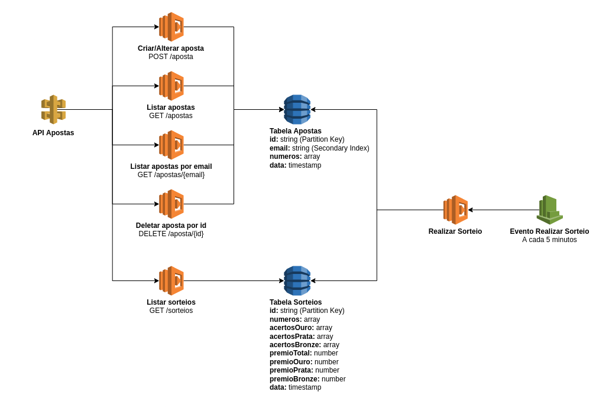

# Loteria Online - Tarefa 2

Essa tarefa tem o propósito de ensinar como criar um evento no Cloud Watch que irá invocar uma Lambda function.

Os principais recursos que deverão ser utilizados:

* Cloud Watch Events
* Lambda
* DynamoDB

Aqui está uma representação visual de como a API final irá ficar:


## Requisitos
* Antes de começar, altere o valor `MENTORSHIP_STACK_NAME` no arquivo `.env`. Esse valor será usado como o nome da stack no CloudFormation.
* Rode o comando `npm i` para instalar as dependências do projeto, neste caso o `loteria-online`.
* Para fazer o deploy da sua stack, você poderá executar `npm run deploy`.
* Você deverá criar testes unitários para suas funções utilizando o framework [Jest](https://jestjs.io/). O ideal é que todas elas tenham 100% de cobertura. Há um exemplo da estrutura padrão do Jest no diretório `src/example/`. (Caso se sentir confortável, configure o Jest para estrutura que você preferir.). Para rodar os testes, execute o comando `npm run test`.
* Utilize a versão do **NodeJs 14x** para todas as Lambdas. Também utilize a arquitetura **arm64**.

## Descrição da Tarefa

1. Criar uma tabela no DynamoDB com as seguintes características:
    * O nome da tabela deverá ser no seguinte formato: `<nome_da_stack>_sorteios`.
    * A tabela deverá ter um campo "id" como partition key, e esse campo será do tipo string.
    * O tipo de cobrança da tabela deverá ser por demanda (**PAY_PER_REQUEST**).
    * Os registros dessa tabela deverão obedecer o seguinte formato:
    ```
        {
          "id": string,
          "numeros": array,
          "acertosOuro": array,
          "acertosPrata": array,
          "acertosBronze": array,
          "premioTotal": number,
          "premioOuro": number,
          "premioPrata": number,
          "premioBronze": number,
          "data": timestamp
        }
    ```

2. Criar uma função para realizar sorteio
    * A função deverá pesquisar na tabela Apostas as apostas que foram criadas nos ultimos 5 minutos. (Utilizar a função `scan` do DynamoDB passando uma expressão comparando o timestamp atual com o do banco)
    * Logo em seguida, a função deverá gerar 3 números aleatórios.
    * A função deverá verificar cada uma das apostas e identificar quantos numeros cada aposta acertou.
        * Os números podem ser na mesma ordem, por exemplo [1,3,6] = [1,3,6]. Ou então os mesmos números mas em ordem diferente, por exemplo [8,5,9] = [9,8,5]. (Fica a seu critério)
    * A função também deverá gerar um valor de prêmio aleatório, algo em torno de R$ 100.000 a R$ 1.000.000 (fica a seu critério). Os valores serão distribuídos da seguinte forma:
        | Classificação | Valor do Prêmio |
        | ----------- | ----------- |
        | Ouro - 3 acertos | 60% do prêmio |
        | Prata - 2 acertos | 30% do prêmio |
        | Bronze - 1 acerto | 10% do prêmio |

        Além disso, caso houver mais de um ganhador na mesma categoria, o prêmio será dividido igualmente. Por exemplo, se o valor total do prêmio for **R$ 100.000**, e houver **5 pessoas** ganhadoras na categoria **Ouro**, **R$ 60.000** será repartido igualmente para as 5 pessoas, dando um total de **R$ 12.000** para cada.
    * Após identificar os ganhadores, gerar um UUID para o campo "id" e inserir um registro na tabela Sorteios com o resumo do sorteio. Exemplo:
        ```
          {
              "id": "d239b3ce-4ab1-40d2-b19f-ff3da3727dac",
              "numeros": [4, 8, 2],
              "acertosOuro": ["pessoa1@gmail.com"],
              "acertosPrata": ["pessoa2@gmail.com", "pessoa3@gmail.com"],
              "acertosBronze": ["pessoa4@gmail.com", "pessoa5@gmail.com", "pessoa6@gmail.com", "pessoa7@gmail.com"],
              "premioTotal": 100000,
              "premioOuro": 60000,
              "premioPrata": 15000, <- 30000 dividido para 2 pessoas
              "premioBronze": 2500, <- 10000 dividido para 4 pessoas
              "data": 213192031
          }
        ```

3. Utilizar a mesma API da **Tarefa 1** e adicionar uma requisição com método `GET` no caminho `/sorteios`. Essa requisição também deverá ter as seguintes características:
    * Ser protegida por uma **API Key**
    * A função deverá buscar os ultimos 20 sorteios realizados. (Utilizar a função `scan` do DynamoDB passando uma expressão comparando o timestamp atual com o do banco). A função deverá retornar uma resposta com status 200 e a seguinte mensagem:
    ```
    {
        "message": "Sorteios encontrados com sucesso!",
        "data": [
            { "id": "exemplo1", "numeros": [1, 2, 3], "acertosOuro": [], ... },
            { "id": "exemplo2", "numeros": [4, 5, 6], "acertosOuro": [], ... },
            { "id": "exemplo3", "numeros": [7, 8, 9], "acertosOuro": [], ... },
        ],
    }
    ```
    * Caso houver algum erro ao buscar os dados na tabela, a função deverá retornar um status 500 com a seguinte mensagem:
    ```
    {
        "message": "Houve um erro ao tentar listar sorteios.",
    } 

4. Criar um evento no CloudWatch para invocar a lambda criada no passo **#2**.
    * O evento deverá invocar a função a cada 5 minutos.
